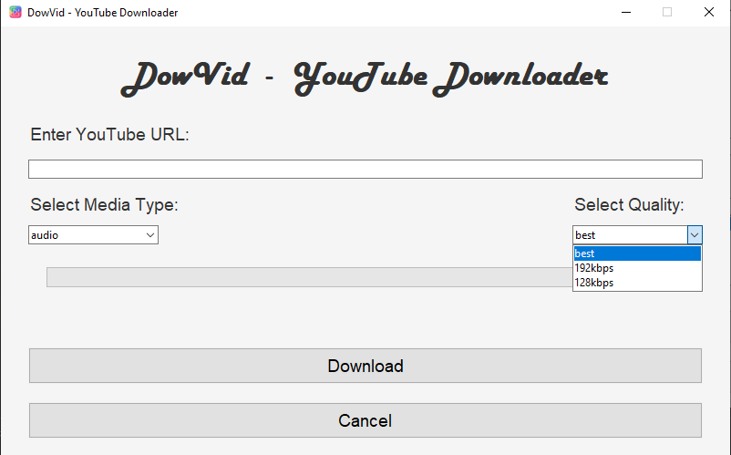
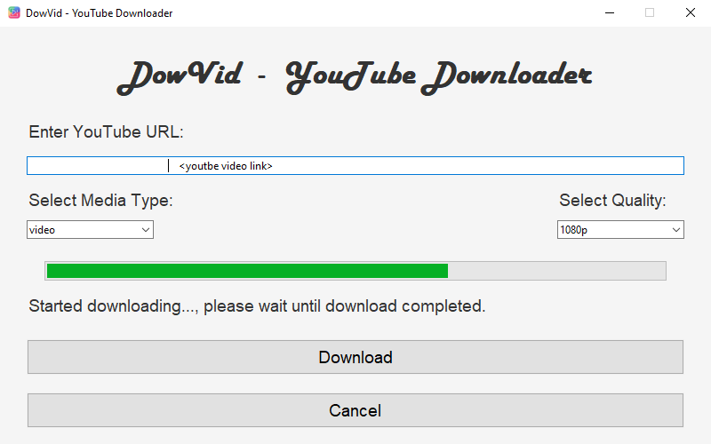

# YouTube Audio/Video Downloader

This is a simple GUI-based YouTube Downloader built using Python's Tkinter library for the interface and `yt-dlp` for downloading YouTube videos or audio.

[](https://github.com/RohitMalwal/DowVid-YT_Video_Downloader)
[](https://github.com/RohitMalwal/DowVid-YT_Video_Downloader)

### Disclaimer

This tool is intended for educational purposes only. Use it responsibly and ensure that you comply with all applicable laws, YouTube's Terms of Service, and content creators' rights. Downloading copyrighted material without permission is illegal.

By using this tool, you acknowledge that you are solely responsible for ensuring the content you download is legally available for download.

## Features

- **Download Video/Audio**: Download the video or audio from YouTube based on the user's selection.
- **Quality Options**: Choose the desired quality for videos or audio (e.g., 1080p, 720p, 192kbps, 128kbps).
- **Progress Bar**: Shows the download progress.
- **Cancel Download**: Cancel the download if needed (by stopping the process in the code).

## Requirements

To run this application, you'll need the following:

- Python 3.x
- `yt-dlp` library
- `tkinter` (usually comes pre-installed with Python)
- `ffmpeg` (if downloading audio or certain video formats)

### Install dependencies

You can install the required libraries using `pip`:

```bash
pip install yt-dlp
```

## Installing FFmpeg

For audio downloads (MP3 format), FFmpeg is required. Follow the instructions below based on your OS:

- **Windows**: Download FFmpeg from [FFmpeg.org](https://ffmpeg.org/download.html). Extract the zip file and add the `bin` folder to your system's `PATH` environment variable.
- **Linux**: Install FFmpeg via the package manager. For example:
    ```bash
    sudo apt install ffmpeg
    ```

- **Mac**:You can use Homebrew to install FFmpeg.
For example:
    ```bash
    brew install ffmpeg
    ```

## Usage

1. Run the script.
2. The GUI will open with fields to enter the YouTube URL, select the media type (audio/video), and select the quality.
3. Enter a valid YouTube URL.
4. Click "Download" to start the process.
5. The progress bar will update as the download progresses.
6. The download will be saved in the current directory.

## How it Works

- **URL Input**: Enter the URL of the YouTube video/audio you want to download.
- **Media Type Selection**: Choose between "audio" or "video".
- **Quality Selection**: Choose the desired quality (e.g., "best", "192kbps", "1080p", etc.).
- **Download Button**: Click to start the download, which will run in a separate thread to keep the UI responsive.
- **Progress Bar**: The progress bar will show the current download progress.

## Example Workflow

1. Enter a URL in the text box (e.g., `https://www.youtube.com/watch?v=your-video`).
2. Select "video" or "audio".
3. Choose the desired quality.
4. Click the "Download" button to start the download process.

## Screenshot







## Troubleshooting

- **Error: No audio/video format found**: This might happen if the YouTube URL is invalid or the selected quality is unavailable. Double-check the URL and try a different quality setting.
- **Download Stuck or Failed**: Ensure that FFmpeg is installed and properly configured in your system's `PATH`.

## Contribution
Feel free to fork the repository, submit issues, and contribute improvements or bug fixes through pull requests. Contributions are always welcome!

## License
This project is open-source and available under the Modified MIT License.

## Author

Developed by **Rohit Malwal**<br>
Feel free to reach out for suggestions or improvements! 😊